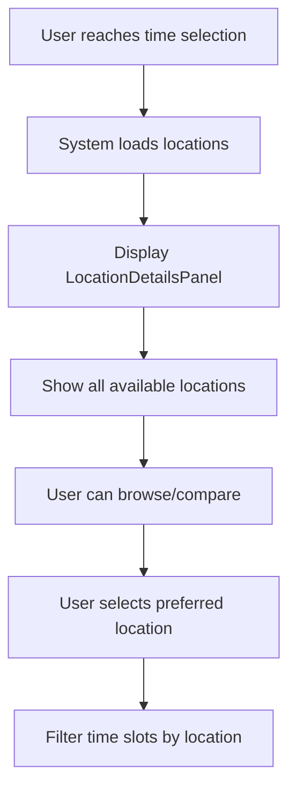

# Design Document - Location Details Enhancement

## Overview

Este documento detalha o design para melhorar a exibição de informações dos estabelecimentos de saúde durante o processo de agendamento. O design foca em fornecer informações claras, acionáveis e organizadas para que o paciente possa tomar decisões informadas sobre onde realizar sua consulta.

## Architecture

### Component Structure
```
TimeSlotGrid.tsx (enhanced)
├── LocationDetailsPanel (novo)
│   ├── LocationCard
│   │   ├── LocationHeader
│   │   ├── LocationInfo
│   │   ├── LocationFacilities
│   │   └── LocationActions
│   └── LocationComparison (novo)
├── TimeSlotButton (enhanced)
└── LocationTimeSlotMapping (novo)
```

### Data Flow
```
1. User selects doctor + date
2. System fetches locations with time slots
3. LocationDetailsPanel displays available locations
4. User can filter time slots by location
5. User selects time slot → location is automatically associated
6. Confirmation shows complete location details
```

## Components and Interfaces

### 1. LocationDetailsPanel Component
```typescript
interface LocationDetailsPanelProps {
  locations: LocationWithTimeSlots[];
  selectedLocation?: string;
  onLocationSelect: (locationId: string) => void;
  onLocationFilter: (locationId: string | null) => void;
  showComparison?: boolean;
}

interface LocationWithTimeSlots {
  id: string;
  nome_local: string;
  endereco_completo: string;
  telefone?: string;
  email?: string;
  website?: string;
  horario_funcionamento: {
    [key: string]: { abertura: string; fechamento: string; fechado?: boolean };
  };
  facilidades: LocationFacility[];
  coordenadas?: { lat: number; lng: number };
  horarios_disponiveis: TimeSlot[];
  ultima_atualizacao: string;
  status: 'ativo' | 'temporariamente_fechado' | 'manutencao';
}
```

**Design Specifications:**
- Layout: Cards em grid responsivo (1-2 colunas)
- Spacing: 24px entre cards, 16px padding interno
- Elevation: shadow-lg para destaque
- Border: 2px solid quando selecionado
- Animation: Smooth transitions (300ms)

### 2. LocationCard Component
```typescript
interface LocationCardProps {
  location: LocationWithTimeSlots;
  isSelected: boolean;
  availableTimeSlots: number;
  onSelect: () => void;
  onViewMap: () => void;
  onCall: () => void;
  onShare: () => void;
  compact?: boolean;
}
```

**Visual Design:**
```css
.location-card {
  @apply bg-white rounded-xl border-2 border-gray-200 p-6 transition-all duration-300;
  @apply hover:shadow-lg hover:border-blue-300;
}

.location-card.selected {
  @apply border-blue-500 bg-blue-50 shadow-xl ring-2 ring-blue-200;
}

.location-card.unavailable {
  @apply opacity-60 bg-gray-50 border-gray-300;
}
```

**Layout Structure:**
1. **Header Section** (flex, items-center, justify-between)
   - Location name (text-xl, font-bold)
   - Status badge (available/closed)
   - Time slots count badge

2. **Info Section** (space-y-3)
   - Address with map icon
   - Phone with call icon
   - Operating hours with clock icon
   - Last updated timestamp

3. **Facilities Section** (flex, flex-wrap, gap-2)
   - Icon badges for each facility
   - Tooltip on hover with details

4. **Actions Section** (flex, gap-2, mt-4)
   - Primary: "Ver no Mapa" button
   - Secondary: "Ligar" button
   - Tertiary: "Compartilhar" button

### 3. LocationFacilities Component
```typescript
interface LocationFacility {
  type: 'estacionamento' | 'acessibilidade' | 'farmacia' | 'laboratorio' | 'wifi' | 'ar_condicionado';
  available: boolean;
  details?: string;
  cost?: 'gratuito' | 'pago';
}

const facilityIcons = {
  estacionamento: ParkingCircle,
  acessibilidade: Accessibility,
  farmacia: Pill,
  laboratorio: TestTube,
  wifi: Wifi,
  ar_condicionado: Wind
};
```

**Design Specifications:**
- Layout: Flex wrap com gap de 8px
- Badge Style: Rounded-full, padding 8px, icon + text
- Colors: Green para disponível, gray para indisponível
- Hover: Tooltip com detalhes adicionais

### 4. Enhanced TimeSlotButton Component
```typescript
interface EnhancedTimeSlotButtonProps extends TimeSlotButtonProps {
  locationId?: string;
  locationName?: string;
  showLocationBadge?: boolean;
  isLocationFiltered?: boolean;
}
```

**Visual Enhancements:**
- Location badge no canto superior direito
- Color coding por localização
- Tooltip mostrando nome do estabelecimento
- Disabled state quando filtro de localização ativo

### 5. LocationTimeSlotMapping Component
```typescript
interface LocationTimeSlotMappingProps {
  timeSlots: TimeSlot[];
  locations: LocationWithTimeSlots[];
  selectedTimeSlot?: string;
  onTimeSlotSelect: (timeSlot: string, locationId: string) => void;
  groupByLocation?: boolean;
}
```

## Data Models

### Enhanced Location Model
```typescript
interface EnhancedLocation {
  // Basic Info
  id: string;
  nome_local: string;
  endereco_completo: string;
  bairro: string;
  cidade: string;
  estado: string;
  cep: string;
  
  // Contact
  telefone?: string;
  whatsapp?: string;
  email?: string;
  website?: string;
  
  // Coordinates
  coordenadas?: {
    lat: number;
    lng: number;
    precisao: 'exata' | 'aproximada';
  };
  
  // Operating Hours
  horario_funcionamento: {
    [key in 'segunda' | 'terca' | 'quarta' | 'quinta' | 'sexta' | 'sabado' | 'domingo']: {
      abertura: string;
      fechamento: string;
      fechado: boolean;
      almoco?: { inicio: string; fim: string };
    };
  };
  
  // Facilities
  facilidades: LocationFacility[];
  
  // Status
  status: 'ativo' | 'temporariamente_fechado' | 'manutencao';
  motivo_fechamento?: string;
  previsao_reabertura?: string;
  
  // Metadata
  ultima_atualizacao: string;
  verificado_em: string;
  fonte_dados: 'manual' | 'api' | 'scraping';
}
```

### TimeSlot Enhancement
```typescript
interface EnhancedTimeSlot {
  time: string;
  available: boolean;
  location_id: string;
  location_name: string;
  duration_minutes: number;
  tipo_consulta: 'presencial' | 'telemedicina';
  valor?: number;
  observacoes?: string;
}
```

## User Experience Flow

### 1. Location Discovery


### 2. Location Selection Process
1. **Initial Display**: All locations shown with available time slots count
2. **Location Filtering**: User can click location to filter time slots
3. **Time Slot Selection**: User selects time → location auto-associated
4. **Confirmation**: Full location details shown in summary

### 3. Information Hierarchy
```
Priority 1: Location name, address, available slots
Priority 2: Phone, operating hours, key facilities
Priority 3: Additional services, last updated, sharing options
```

## Responsive Design

### Mobile (< 768px)
- Single column layout
- Compact location cards
- Collapsible facility details
- Touch-friendly action buttons
- Swipe gestures for location comparison

### Tablet (768px - 1024px)
- Two column layout for locations
- Medium-sized cards
- Visible facility badges
- Hover states for interactive elements

### Desktop (> 1024px)
- Two column layout with sidebar option
- Full-featured location cards
- Hover tooltips and animations
- Keyboard navigation support

## Accessibility Features

### Screen Reader Support
- Proper ARIA labels for all interactive elements
- Live regions for dynamic content updates
- Descriptive text for facility icons
- Clear heading hierarchy

### Keyboard Navigation
- Tab order: Location cards → Action buttons → Time slots
- Enter/Space to select locations
- Arrow keys for time slot navigation
- Escape to clear filters

### Visual Accessibility
- High contrast mode support
- Focus indicators (2px blue outline)
- Color-blind friendly facility icons
- Scalable text and icons

## Performance Considerations

### Data Loading
- Lazy load location details on demand
- Cache location data for 15 minutes
- Progressive image loading for maps
- Debounced search/filter operations

### Rendering Optimization
- Virtual scrolling for large location lists
- Memoized location cards
- Optimized re-renders on selection
- Skeleton loading states

## Integration Points

### Maps Integration
```typescript
interface MapIntegration {
  provider: 'google' | 'openstreetmap' | 'mapbox';
  showLocation: (coordinates: Coordinates) => void;
  getDirections: (from: Coordinates, to: Coordinates) => void;
  shareLocation: (location: Location, method: 'whatsapp' | 'sms' | 'email') => void;
}
```

### Communication Integration
```typescript
interface CommunicationIntegration {
  makeCall: (phoneNumber: string) => void;
  sendWhatsApp: (phoneNumber: string, message: string) => void;
  sendEmail: (email: string, subject: string, body: string) => void;
  shareViaSystem: (content: ShareContent) => void;
}
```

## Error Handling

### Location Data Errors
- Fallback to basic info if detailed data unavailable
- Clear error messages for outdated information
- Retry mechanisms for failed API calls
- Graceful degradation for missing facilities

### User Action Errors
- Validation before external app launches
- Fallback options if primary action fails
- Clear feedback for successful actions
- Undo options where applicable

## Testing Strategy

### Unit Tests
- Location card rendering with various data states
- Facility badge display logic
- Time slot filtering by location
- Action button functionality

### Integration Tests
- Location data loading and caching
- Map integration functionality
- Communication app launches
- Responsive layout behavior

### User Experience Tests
- Location comparison workflow
- Time slot selection with location association
- Mobile touch interactions
- Accessibility compliance validation