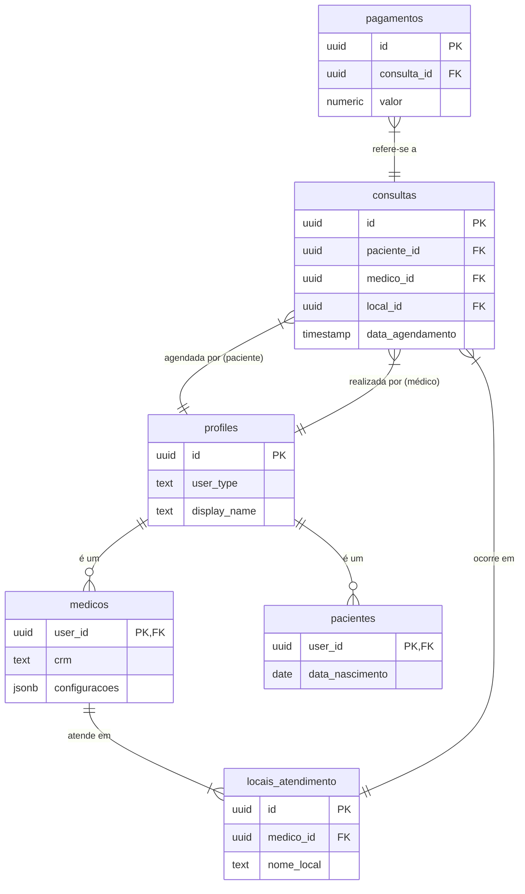

# Diagnóstico Completo do Banco de Dados

Este documento fornece um mapa detalhado da estrutura do banco de dados, incluindo tabelas, relacionamentos, funções e políticas de segurança. A análise foi baseada nos scripts de migração e investigação encontrados no repositório.

## 1. Estrutura das Tabelas Principais

A seguir, a descrição das tabelas centrais do sistema.

### 1.1. `profiles`

Esta tabela armazena os perfis de todos os usuários do sistema, sejam eles pacientes ou médicos. É a tabela central de autenticação e identificação.

- **Propósito:** Gerenciar informações básicas e de autenticação dos usuários.
- **Relação com `auth.users`:** O `id` desta tabela é uma chave estrangeira que referencia `auth.users.id` no esquema de autenticação do Supabase.

| Coluna | Tipo Inferido | Descrição |
| --- | --- | --- |
| `id` | `uuid` (Primary Key) | Identificador único do usuário, ligado à autenticação. |
| `user_type` | `text` | Tipo de usuário (ex: 'paciente', 'medico'). |
| `display_name` | `text` | Nome de exibição do usuário. |
| `email` | `text` | Endereço de e-mail (pode ser duplicado de `auth.users`). |
| `avatar_url` | `text` | URL para a imagem de perfil do usuário. |
| `created_at` | `timestamp` | Data e hora de criação do perfil. |
| `updated_at` | `timestamp` | Data e hora da última atualização do perfil. |

### 1.2. `medicos`

Armazena informações específicas dos profissionais de saúde.

- **Propósito:** Gerenciar dados profissionais dos médicos, como CRM e especialidades.
- **Relação:** Ligada à tabela `profiles` através de uma relação 1-para-1 com `user_id`.

| Coluna | Tipo Inferido | Descrição |
| --- | --- | --- |
| `user_id` | `uuid` (Primary Key, Foreign Key) | Referencia `profiles.id`. |
| `crm` | `text` | Registro do Conselho Regional de Medicina. |
| `especialidades` | `jsonb` ou `text[]` | Lista de especialidades do médico. |
| `configuracoes` | `jsonb` | Configurações específicas da agenda e perfil do médico. |
| `bio` | `text` | Uma breve biografia do médico. |
| `created_at` | `timestamp` | Data e hora de criação do registro. |
| `updated_at` | `timestamp` | Data e hora da última atualização. |

### 1.3. `pacientes`

Armazena informações específicas dos pacientes.

- **Propósito:** Gerenciar dados dos pacientes.
- **Relação:** Ligada à tabela `profiles` através de uma relação 1-para-1 com `user_id`.

| Coluna | Tipo Inferido | Descrição |
| --- | --- | --- |
| `user_id` | `uuid` (Primary Key, Foreign Key) | Referencia `profiles.id`. |
| `data_nascimento` | `date` | Data de nascimento do paciente. |
| `cpf` | `text` | CPF do paciente. |
| `telefone` | `text` | Telefone de contato. |
| `endereco` | `text` | Endereço do paciente. |
| `historico_medico` | `jsonb` | Informações sobre o histórico médico. |
| `created_at` | `timestamp` | Data e hora de criação do registro. |
| `updated_at` | `timestamp` | Data e hora da última atualização. |

### 1.4. `locais_atendimento`

Descreve os locais onde os médicos atendem.

- **Propósito:** Gerenciar informações detalhadas sobre as clínicas e consultórios.
- **Relação:** Um médico (`medicos`) pode ter vários locais de atendimento (1-para-N).

| Coluna | Tipo Inferido | Descrição |
| --- | --- | --- |
| `id` | `uuid` (Primary Key) | Identificador único do local. |
| `medico_id` | `uuid` (Foreign Key) | Referencia `medicos.user_id`. |
| `nome_local` | `text` | Nome do consultório ou clínica. |
| `endereco_completo` | `text` | Endereço formatado. |
| `bairro`, `cidade`, `estado`, `cep` | `text` | Componentes do endereço. |
| `coordenadas` | `jsonb` | Latitude e longitude para mapas. |
| `facilidades` | `jsonb` | Lista de facilidades (ex: estacionamento, acessibilidade). |
| `horario_funcionamento` | `jsonb` | Horários de atendimento. |
| `status` | `text` | Status operacional do local (ex: 'ativo', 'fechado'). |
| `ativo` | `boolean` | (Legado) Indica se o local está ativo. |

### 1.5. `consultas`

Tabela central que gerencia os agendamentos.

- **Propósito:** Registrar e gerenciar todas as consultas agendadas no sistema.
- **Relação:** Conecta `pacientes` e `medicos`.

| Coluna | Tipo Inferido | Descrição |
| --- | --- | --- |
| `id` | `uuid` (Primary Key) | Identificador único da consulta. |
| `paciente_id` | `uuid` (Foreign Key) | Referencia `pacientes.user_id`. |
| `medico_id` | `uuid` (Foreign Key) | Referencia `medicos.user_id`. |
| `local_id` | `uuid` (Foreign Key) | Referencia `locais_atendimento.id`. |
| `data_agendamento` | `timestamp` | Data e hora da consulta. |
| `status` | `text` | Status da consulta (ex: 'agendada', 'cancelada', 'realizada'). |
| `tipo_consulta` | `text` | Ex: 'primeira_consulta', 'retorno'. |
| `preco` | `numeric` | Valor da consulta. |
| `notas` | `text` | Anotações sobre a consulta. |

### 1.6. `pagamentos`

Registra as transações financeiras relacionadas às consultas.

- **Propósito:** Gerenciar o ciclo de vida dos pagamentos.
- **Relação:** Ligada à tabela `consultas`.

| Coluna | Tipo Inferido | Descrição |
| --- | --- | --- |
| `id` | `uuid` (Primary Key) | Identificador único do pagamento. |
| `consulta_id` | `uuid` (Foreign Key) | Referencia `consultas.id`. |
| `valor` | `numeric` | Montante do pagamento. |
| `status` | `text` | Status do pagamento (ex: 'pendente', 'pago', 'falhou'). |
| `metodo_pagamento` | `text` | Ex: 'cartao_credito', 'pix'. |
| `stripe_charge_id`| `text` | ID da transação no gateway de pagamento. |
| `created_at` | `timestamp` | Data e hora de criação do pagamento. |
| `updated_at` | `timestamp` | Data e hora da última atualização. |

## 2. Relacionamentos entre Tabelas

As tabelas do banco de dados são interconectadas através de chaves estrangeiras (`Foreign Keys`). A seguir, um resumo dos principais relacionamentos.

- **`profiles` ↔ `auth.users` (1-para-1)**
  - O `profiles.id` é uma chave estrangeira que aponta para `auth.users.id`. Cada usuário no sistema de autenticação do Supabase tem um único perfil correspondente.

- **`profiles` → `medicos` (1-para-1)**
  - O `medicos.user_id` aponta para `profiles.id`. Um perfil do tipo 'medico' tem um registro correspondente na tabela `medicos` com informações profissionais.

- **`profiles` → `pacientes` (1-para-1)**
  - O `pacientes.user_id` aponta para `profiles.id`. Um perfil do tipo 'paciente' tem um registro correspondente na tabela `pacientes`.

- **`medicos` → `locais_atendimento` (1-para-N)**
  - O `locais_atendimento.medico_id` aponta para `medicos.user_id`. Um médico pode ter vários locais de atendimento cadastrados.

- **`consultas` → `profiles` (N-para-1, via `paciente_id`)**
  - O `consultas.paciente_id` aponta para `profiles.id`, ligando a consulta ao perfil do paciente.

- **`consultas` → `profiles` (N-para-1, via `medico_id`)**
  - O `consultas.medico_id` aponta para `profiles.id`, ligando a consulta ao perfil do médico.

- **`consultas` → `locais_atendimento` (N-para-1)**
  - O `consultas.local_id` aponta para `locais_atendimento.id`, especificando onde a consulta ocorrerá.

- **`pagamentos` → `consultas` (1-para-1 ou 1-para-N)**
  - O `pagamentos.consulta_id` aponta para `consultas.id`. Uma consulta pode ter um ou mais pagamentos associados (ex: pagamento e estorno).

### Diagrama de Relacionamento (Simplificado)

## 3. Funções Principais do Banco de Dados (Business Logic)

O banco de dados contém uma quantidade significativa de lógica de negócio implementada através de funções PostgreSQL. Isso é comum em projetos com Supabase para garantir segurança e consistência.

### `get_doctors_by_location_and_specialty(p_specialty, p_city, p_state)`
- **Propósito:** Busca médicos com base na especialidade e localização.
- **Parâmetros:**
    - `p_specialty` (text): A especialidade desejada (ex: 'Cardiologia').
    - `p_city` (text): A cidade para a busca.
    - `p_state` (text): O estado para a busca.
- **Retorno:** Uma tabela de perfis de médicos que correspondem aos critérios.
- **Fonte:** `diagnostico-banco.js`.

### `search_locations(...)`
- **Propósito:** Realiza uma busca avançada por locais de atendimento, com múltiplos filtros.
- **Parâmetros:** Inclui termos de busca, cidade, bairro, status, facilidades, etc.
- **Retorno:** Uma tabela com os locais que correspondem aos filtros, junto com um `match_score`.
- **Fonte:** `20250208_location_enhancement_schema.sql`.

### `get_enhanced_location_data(location_ids)`
- **Propósito:** Retorna dados detalhados e computados sobre locais de atendimento específicos.
- **Parâmetros:** `location_ids` (array de UUIDs).
- **Retorno:** Uma tabela com informações completas do local, incluindo campos calculados como `is_open_now` e `facility_count`.
- **Fonte:** `20250208_location_enhancement_schema.sql`.

### `get_doctor_schedule_data(p_doctor_id)`
- **Propósito:** Obtém a configuração da agenda de um médico e a lista de seus locais de atendimento.
- **Parâmetros:** `p_doctor_id` (UUID do médico).
- **Retorno:** Um JSON com as configurações do médico e um array JSON dos seus locais.
- **Fonte:** `20250208_location_enhancement_schema.sql`.

### `reserve_appointment_slot(...)`
- **Propósito:** (Existência inferida de `database-investigation.sql`) Provavelmente, esta função é o coração do agendamento, responsável por criar o registro da consulta e garantir que o horário não seja duplamente reservado (controle de concorrência).
- **Parâmetros:** Deve receber `paciente_id`, `medico_id`, `local_id`, e `data_agendamento`.
- **Retorno:** Possivelmente o ID da consulta criada ou um booleano indicando sucesso.
- **Fonte:** `database-investigation.sql`.

### Funções de Gatilho (Triggers)
- **`update_location_timestamp()`:** Atualiza automaticamente o campo `ultima_atualizacao` na tabela `locais_atendimento` sempre que um registro é modificado.
- **`notify_location_status_change()`:** Envia uma notificação via `pg_notify` quando o `status` de um local de atendimento é alterado.

## 4. Políticas de Segurança (Row-Level Security - RLS)

A segurança do banco de dados é implementada primariamente através de RLS, garantindo que os usuários só possam acessar os dados que lhes são permitidos.

### `locais_atendimento`
- **Leitura:** Usuários autenticados (`authenticated`) podem ver locais com status 'ativo'. Médicos podem ver todos os seus próprios locais, independentemente do status.
- **Escrita (Criar, Atualizar, Deletar):** Apenas o médico "dono" do local (`auth.uid() = medico_id`) pode modificar seus próprios registros.
- **Acesso Total:** A role `service_role` (usada no backend, como em serverless functions) tem acesso irrestrito.

### `profiles`
- **Leitura:** Geralmente, os perfis são públicos ou visíveis para usuários autenticados.
- **Escrita:** Um usuário só pode modificar seu próprio perfil (`auth.uid() = id`).

### `consultas`
- **Leitura:**
    - Um paciente pode ver apenas as suas próprias consultas (`auth.uid() = paciente_id`).
    - Um médico pode ver apenas as consultas agendadas com ele (`auth.uid() = medico_id`).
- **Escrita:**
    - A criação é provavelmente feita através de uma função com `SECURITY DEFINER` (`reserve_appointment_slot`) para contornar as permissões do usuário final e executar com privilégios elevados de forma segura.
    - A atualização/cancelamento segue as mesmas regras da leitura (paciente cancela sua consulta, médico gerencia a sua).

### `pagamentos`
- **Leitura/Escrita:** Segue a mesma lógica da tabela `consultas`. O acesso é restrito ao paciente e ao médico envolvidos na consulta relacionada ao pagamento.

## 5. Resumo Executivo e Conclusões

O banco de dados está bem-estruturado e segue as melhores práticas para uma aplicação baseada em Supabase, com um uso inteligente de RLS e funções PostgreSQL para encapsular a lógica de negócio.

- **Arquitetura Centralizada:** O sistema gira em torno da tabela `profiles`, que se ramifica em `medicos` e `pacientes`. A tabela `consultas` é o nexo que une esses dois lados do sistema.
- **Segurança Robusta:** O uso de RLS é consistente e garante que os dados dos usuários sejam isolados e protegidos. A delegação de operações complexas (como criar agendamentos) para funções `SECURITY DEFINER` é uma abordagem correta.
- **Lógica no Banco de Dados:** Uma parte significativa da lógica de negócio (buscas, validações, agendamentos) reside no banco de dados. Isso é uma característica importante da arquitetura e deve ser levado em conta em qualquer plano de reconstrução. Qualquer mudança na UI ou no backend que envolva essas operações precisará considerar e possivelmente atualizar essas funções.
- **Riqueza de Dados:** A tabela `locais_atendimento` é particularmente rica em dados, indicando uma funcionalidade de busca de locais bastante avançada.

Este diagnóstico fornece uma base sólida para a reconstrução do sistema. Os próximos passos devem envolver a análise do código do frontend para entender como estes recursos do banco de dados são consumidos pela aplicação.
