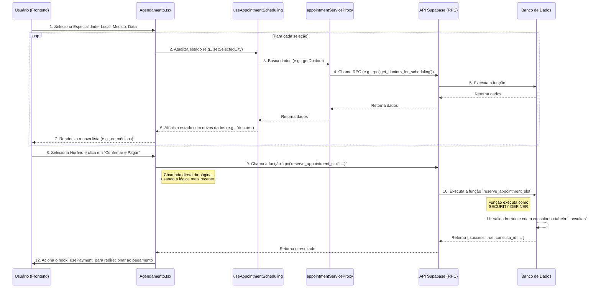

# Mergulho Profundo no Schema `public`: Conectando Backend e Frontend

Este documento oferece uma análise detalhada do schema `public`, explicando o propósito de negócio de cada componente do banco de dados e como ele é consumido pelo frontend da aplicação.

## 1. Tabelas do Schema `public` e seu Propósito no Frontend

Esta seção detalha as tabelas principais, seus objetivos de negócio e quais partes do frontend as consomem.

---

### 1.1. Tabela: `profiles`
- **Objetivo de Negócio:** Manter a identidade central de todos os usuários. É a fonte da verdade para saber quem é um usuário e qual é o seu tipo (paciente ou médico).
- **Conexão com o Frontend:**
    - **Consumido por:** Praticamente todos os componentes que precisam exibir informações do usuário (nome, avatar), como o `Header.tsx` e `AppSidebar.tsx`.
    - **Hook Principal:** `useAuth()` (no `AuthContext.tsx`) é o principal provedor desses dados para toda a aplicação.
    - **Página de Gerenciamento:** `src/pages/Perfil.tsx` é a página onde um usuário edita suas próprias informações de perfil.

---

### 1.2. Tabela: `medicos`
- **Objetivo de Negócio:** Armazenar dados exclusivos dos médicos que não se encaixam no perfil geral, como CRM, especialidades e, crucialmente, as configurações de sua agenda (`configuracoes`).
- **Conexão com o Frontend:**
    - **Consumido por:** O `EnhancedDoctorSelect.tsx` na página de agendamento exibe os médicos. As informações são carregadas pelo hook `useAppointmentScheduling.ts`.
    - **Página de Gerenciamento:** `src/pages/PerfilMedico.tsx` e `src/pages/GerenciarAgenda.tsx` são as páginas onde o médico configura seu perfil profissional e horários de atendimento.

---

### 1.3. Tabela: `locais_atendimento`
- **Objetivo de Negócio:** Permitir que médicos cadastrem múltiplos locais de atendimento e que pacientes os encontrem. A riqueza de dados (facilidades, coordenadas) sugere uma funcionalidade de busca avançada.
- **Conexão com o Frontend:**
    - **Consumido por:** O `EnhancedTimeSlotGrid.tsx` exibe os horários agrupados por local. A função `getAvailableSlotsByDoctor` no `newAppointmentService.ts` busca esses locais e seus horários.
    - **Página de Gerenciamento:** `src/pages/GerenciarLocais.tsx` é a tela onde os médicos podem adicionar, editar e remover seus locais.

---

### 1.4. Tabela: `consultas`
- **Objetivo de Negócio:** É a tabela transacional mais importante. Registra cada agendamento, servindo como o elo entre pacientes e médicos. O status da consulta (`agendada`, `cancelada`, `realizada`) e o status do pagamento (`pendente`, `pago`) controlam o fluxo de vida de um agendamento.
- **Conexão com o Frontend:**
    - **Consumido por:** A página `src/pages/AgendaPaciente.tsx` e `src/pages/DashboardMedico.tsx` listam as consultas para pacientes e médicos, respectivamente.
    - **Criado por:** O processo de criação é iniciado na página `src/pages/Agendamento.tsx`, que, ao final, chama a função `reserve_appointment_slot` ou insere diretamente na tabela, dependendo da versão da lógica (foi encontrada uma inconsistência aqui).

---

### 1.5. Tabela: `pagamentos`
- **Objetivo de Negócio:** Rastrear o estado financeiro de uma consulta. Está separada da tabela `consultas` para permitir um histórico financeiro mais complexo (ex: múltiplos estornos, tentativas de pagamento).
- **Conexão com o Frontend:**
    - **Consumido por:** A página `src/pages/Financeiro.tsx` provavelmente exibe o histórico de transações para o médico.
    - **Criado por:** O hook `usePayment.ts` é acionado após a reserva de uma consulta na página `Agendamento.tsx`. Ele provavelmente cria um registro inicial de pagamento e interage com o Stripe para processar a transação.

## 2. Funções do Banco de Dados e seus Gatilhos no Frontend

As funções PostgreSQL (`rpc` calls) são os endpoints da nossa API de lógica de negócio. O frontend as chama para executar operações que são muito complexas ou sensíveis para serem feitas com queries diretas.

---

### 2.1. Função: `get_specialties`
- **Propósito:** Retorna uma lista de todas as especialidades médicas disponíveis na plataforma.
- **Gatilho no Frontend:**
    - **Onde:** `src/pages/Agendamento.tsx`
    - **Quando:** A função é chamada assim que o componente de agendamento é carregado.
    - **Como:** O hook `useAppointmentScheduling.ts` a chama através do `appointmentServiceProxy` para popular o seletor de especialidades (`SpecialtySelect.tsx`).

---

### 2.2. Funções: `get_available_states` e `get_available_cities`
- **Propósito:** Retornar as listas de estados e cidades onde há médicos disponíveis, evitando que o usuário selecione uma localidade vazia.
- **Gatilho no Frontend:**
    - **Onde:** `src/pages/Agendamento.tsx`
    - **Quando:** `get_available_states` é chamada no carregamento inicial. `get_available_cities` é chamada quando o usuário seleciona um estado.
    - **Como:** O hook `useAppointmentScheduling.ts` chama essas funções diretamente via `supabase.rpc()` para popular os seletores `EnhancedStateSelect.tsx` and `EnhancedCitySelect.tsx`.

---

### 2.3. Função: `get_doctors_for_scheduling`
- **Propósito:** É o principal mecanismo de busca. Encontra médicos que correspondem a uma especialidade e localidade.
- **Gatilho no Frontend:**
    - **Onde:** `src/pages/Agendamento.tsx`
    - **Quando:** É chamada depois que o usuário selecionou uma especialidade, estado e cidade.
    - **Como:** O hook `useAppointmentScheduling.ts` a chama através do `appointmentServiceProxy` para popular o seletor `EnhancedDoctorSelect.tsx`.

---

### 2.4. Função: `getAvailableSlotsByDoctor` (no `newAppointmentService`)
- **Propósito:** Esta é uma função do lado do servidor (mas no código da aplicação, não um RPC) que calcula os horários disponíveis para um médico em um dia específico. Ela busca a configuração de horários do médico, busca as consultas já agendadas, e retorna os "slots" livres.
- **Gatilho no Frontend:**
    - **Onde:** `src/pages/Agendamento.tsx`
    - **Quando:** É chamada depois que o usuário seleciona um médico e uma data.
    - **Como:** O hook `useAppointmentScheduling.ts` a chama através do `appointmentServiceProxy` para popular a grade de horários `EnhancedTimeSlotGrid.tsx`.

---

### 2.5. Função: `reserve_appointment_slot`
- **Propósito:** A função de `SECURITY DEFINER` que centraliza a lógica de criação de agendamentos de forma segura.
- **Gatilho no Frontend:**
    - **Onde:** `src/pages/Agendamento.tsx`
    - **Quando:** É chamada quando o usuário clica no botão "Confirmar e Pagar" na última etapa do agendamento.
    - **Como:** A página `Agendamento.tsx` chama esta função diretamente via `supabase.rpc()`. **Nota:** Foi encontrada uma inconsistência, pois o `newAppointmentService.ts` usa um método de inserção direta. A chamada RPC na página parece ser a implementação mais recente e segura.

## 3. Diagramas de Fluxo de Dados (End-to-End)

Estes diagramas ilustram o fluxo completo de uma interação do usuário, desde o clique no frontend até a resposta do banco de dados.

### 3.1. Fluxo: Agendamento de Consulta

Este diagrama mostra a jornada completa do usuário para agendar uma nova consulta. Ele é o fluxo mais complexo e vital do sistema.

Este fluxo demonstra claramente como a responsabilidade é dividida:
- O **Componente React (`Agendamento.tsx`)** gerencia a UI e o estado da página.
- O **Hook (`useAppointmentScheduling`)** orquestra a lógica de busca de dados e o estado global do agendamento.
- O **Serviço (`appointmentServiceProxy`)** abstrai a fonte dos dados (mock ou real).
- O **Banco de Dados (via Funções RPC)** executa a lógica de negócio de forma segura e centralizada.
