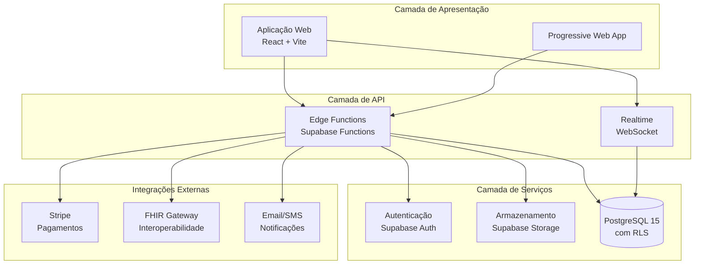
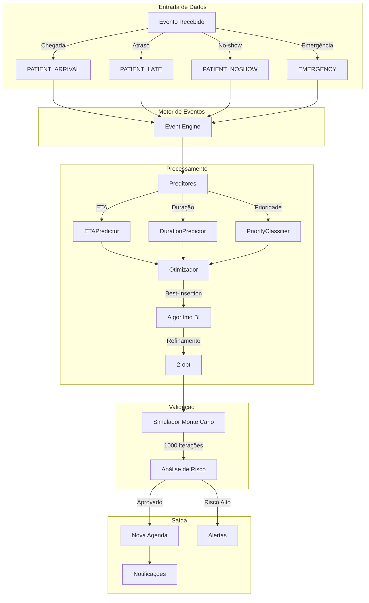
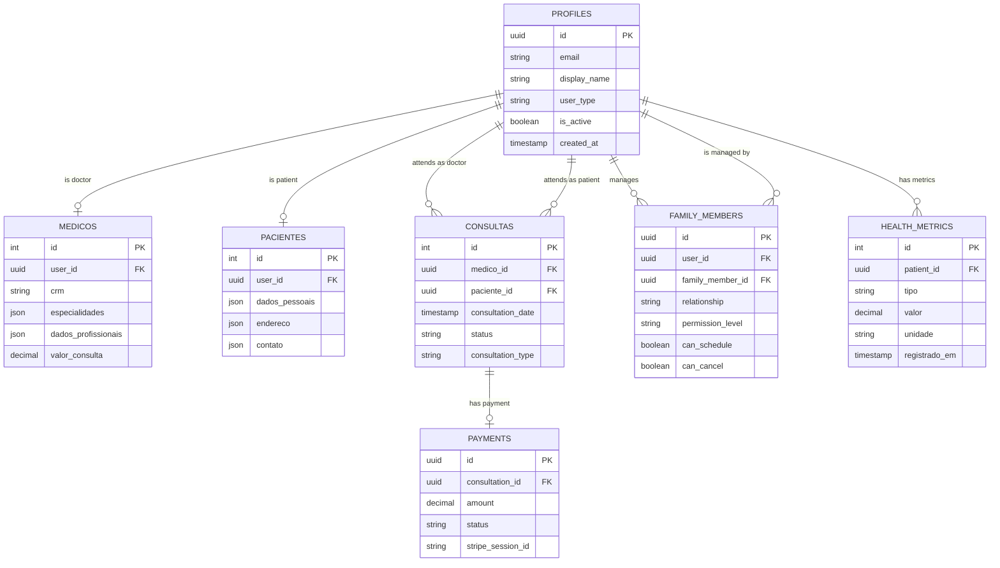
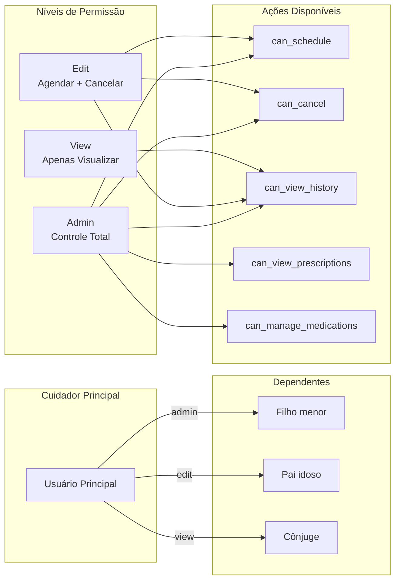
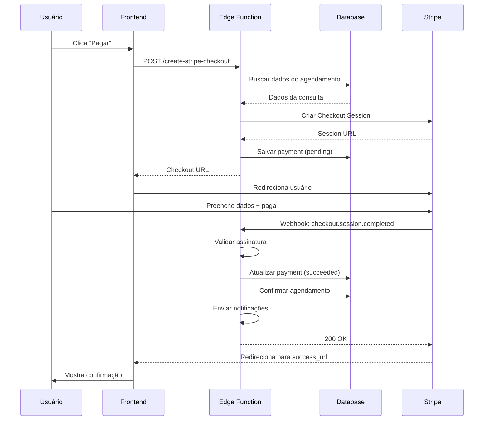
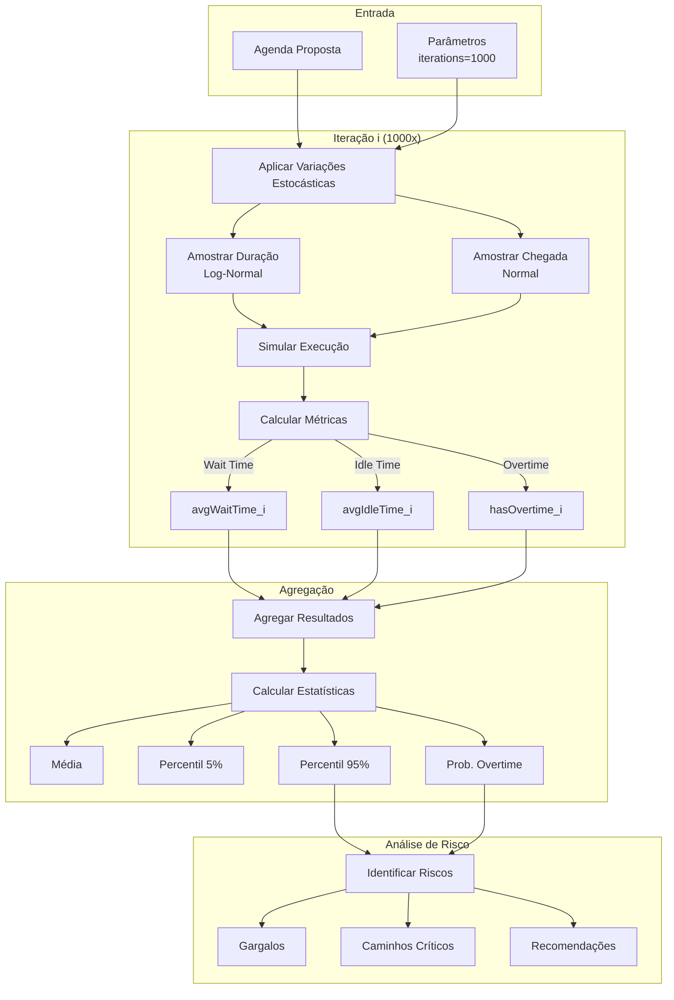
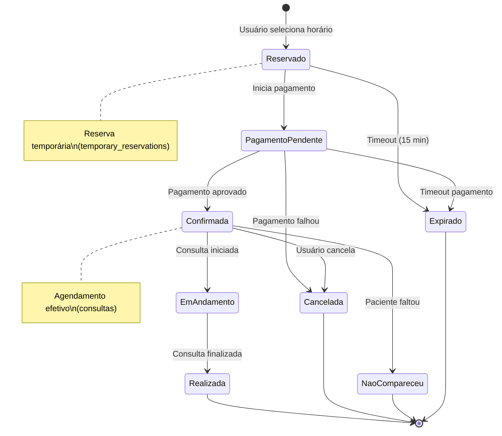
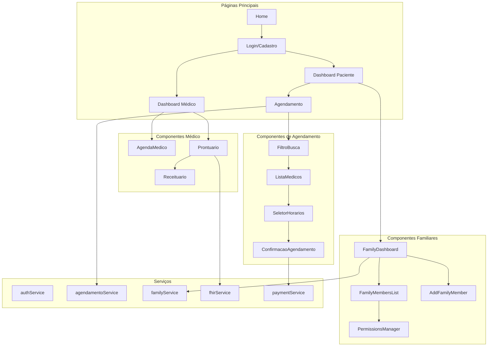

# Diagramas de Arquitetura para Documentação de Patente

Este documento contém os diagramas técnicos em formato Mermaid para ilustrar a arquitetura do sistema de telemedicina.

---

## 1. Arquitetura Geral do Sistema



---

## 2. Fluxo de Agendamento Completo

```mermaid
sequenceDiagram
    participant P as Paciente
    participant UI as Interface Web
    participant API as Edge Function
    participant DB as PostgreSQL
    participant OPT as Otimizador
    participant PAY as Stripe
    participant NOT as Notificações
    
    P->>UI: Seleciona especialidade/médico
    UI->>API: GET /available-slots
    API->>DB: Buscar disponibilidade
    DB-->>API: Slots disponíveis
    API-->>UI: Lista de horários
    
    P->>UI: Seleciona horário
    UI->>API: POST /reserve-appointment
    API->>DB: Criar reserva temporária
    API->>OPT: Validar otimização
    OPT-->>API: Slot válido
    DB-->>API: Reserva criada
    API-->>UI: ID da reserva + URL pagamento
    
    UI->>PAY: Redireciona para checkout
    P->>PAY: Realiza pagamento
    PAY->>API: Webhook: pagamento confirmado
    
    API->>DB: Confirmar agendamento
    API->>NOT: Enviar confirmação
    NOT->>P: Email/SMS confirmação
    
    API-->>UI: Agendamento confirmado
```

---

## 3. Fluxo de Otimização em Tempo Real



---

## 4. Modelo de Dados - Entidades Principais



---

## 5. Sistema de Permissões Familiares



---

## 6. Arquitetura FHIR

```mermaid
flowchart TB
    subgraph "Dados Internos"
        PROF[profiles]
        METR[health_metrics]
        CONS[consultas]
        PRESC[medical_prescriptions]
    end
    
    subgraph "Camada de Conversão"
        FUNC1[convert_profile_to_fhir_patient]
        FUNC2[convert_health_metric_to_fhir]
        TS[fhirService.ts]
    end
    
    subgraph "Cache FHIR"
        CACHE[(fhir_resources)]
    end
    
    subgraph "API FHIR"
        API1[/fhir/Patient]
        API2[/fhir/Observation]
        API3[/fhir/Practitioner]
        API4[/fhir/Appointment]
    end
    
    subgraph "Clientes Externos"
        RNDS[RNDS<br/>Rede Nacional]
        LAB[Laboratórios]
        HOSP[Hospitais]
    end
    
    PROF --> FUNC1
    METR --> FUNC2
    FUNC1 --> CACHE
    FUNC2 --> CACHE
    
    CACHE --> API1
    CACHE --> API2
    CONS --> TS --> API4
    
    API1 --> RNDS
    API2 --> LAB
    API4 --> HOSP
```

---

## 7. Fluxo de Pagamento com Stripe



---

## 8. Fluxo do Simulador Monte Carlo



---

## 9. Estados do Agendamento



---

## 10. Componentes do Frontend



---

## Notas de Uso

Estes diagramas foram criados usando sintaxe Mermaid e podem ser renderizados em:
- GitHub/GitLab (nativamente)
- Documentação Markdown com suporte Mermaid
- Ferramentas como Mermaid Live Editor (https://mermaid.live)
- Exportação para PNG/SVG para documentos de patente

Para uso em documentos de patente, recomenda-se exportar como imagens vetoriais (SVG) para máxima qualidade de impressão.
